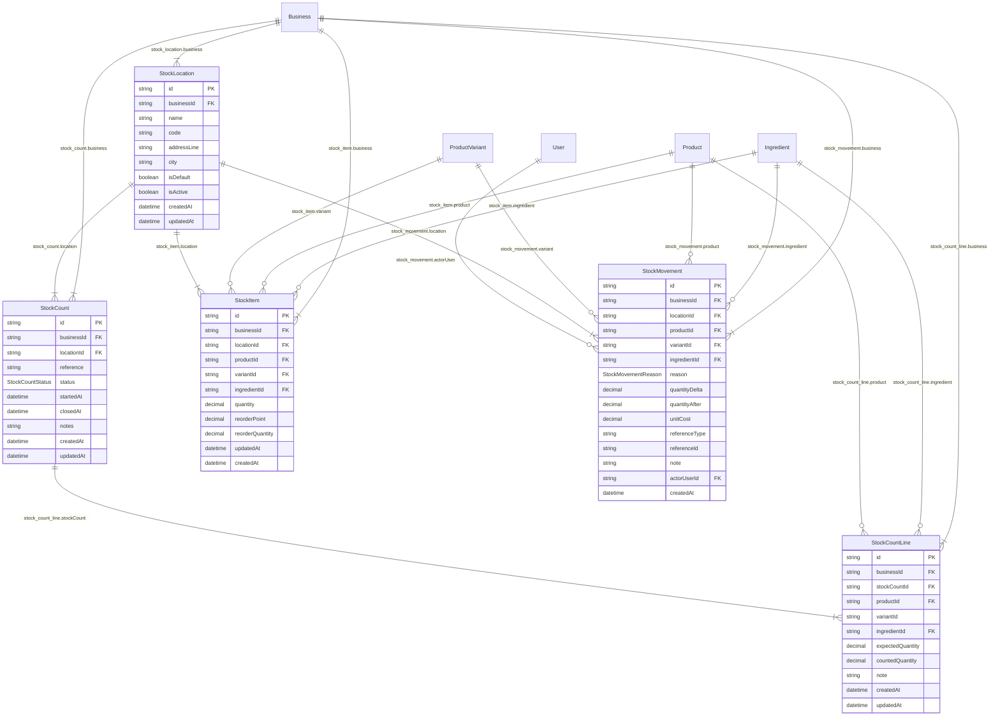

<!-- GENERATED by apps/api/scripts/generate-erd.mjs — do not edit by hand. -->

# inventory-stock (5 models)

An edge to a box that is not declared in this file is a relation leaving this domain — which is
deliberate, so a cross-domain dependency is visible rather than implied. `PK`/`UK`/`FK` mark the
key columns. Regenerate with `pnpm db:erd`; CI fails if this file is stale.

